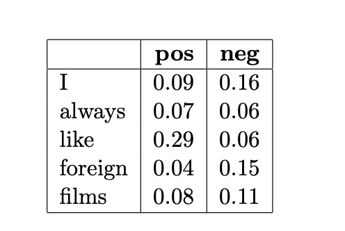

#### Naive Bayes Classifier

1. Question: What class will Naıve Bayes assign to the sentence “I always like foreign films”? Show your work.



```
p( + | I, always, like, foreign, films) = p(+) * p(I, always, like, foreign, films | + )
                                    = p(+) * p( I | + ) * p( always | + ) * p( like | + ) * p( foreign | + ) * p( films | + )
                                    = 0.4 * 0.09 * 0.07 * 0.29 * 0.04 * 0.08
                                    = 2.33856 * 10^(-6)
                                    

p( - | I, always, like, foreign, films) = p(-) * p(I, always, like, foreign, films | - )
                                    = p(-) * p( I | - ) * p( always | - ) * p( like | - ) * p( foreign | - ) * p( films | - )
                                    = 0.6 * 0.16 * 0.06 * 0.06 * 0.15 * 0.11
                                    = 5.7024 * 10^(-6)

By comparing the result of above two expressions, we find the probability of negative is higher. Therefore, the class negative will be assigned to the sentence.
```