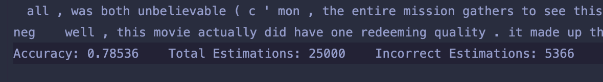

## Naive Bayes Classifier

### 1. Question: What class will Naıve Bayes assign to the sentence “I always like foreign films”? Show your work.


```
p( + | I, always, like, foreign, films) = p(+) * p(I, always, like, foreign, films | + )
                                    = p(+) * p( I | + ) * p( always | + ) * p( like | + ) * p( foreign | + ) * p( films | + )
                                    = 0.4 * 0.09 * 0.07 * 0.29 * 0.04 * 0.08
                                    = 2.33856 * 10^(-6)
                                    

p( - | I, always, like, foreign, films) = p(-) * p(I, always, like, foreign, films | - )
                                    = p(-) * p( I | - ) * p( always | - ) * p( like | - ) * p( foreign | - ) * p( films | - )
                                    = 0.6 * 0.16 * 0.06 * 0.06 * 0.15 * 0.11
                                    = 5.7024 * 10^(-6)

By comparing the result of above two expressions, we find the probability of negative is higher. Therefore, the class negative will be assigned to the sentence.
```

### 2a. Train Naive Bayes Classifier

#### Preprocessing

The file `pre_process.py` preprocess files, converting them into vectors and save them into one file.

The function below is used for preprocessing. 
It takes a few parameter
- `folder_path1` is the folder of files that has class `path1_class`, same applies to `folder_path2`
- `vocab_path` is the file that contains vocabulary
- `output_path` is the file to save the label and feature vector of each comment

The output file uses string `#####` as column separator since json string contains many space character.

An example of a line in output is `neg#####JSON of BOW#####1#####0`

```
preprocess(folder_path1="./data/train/pos",
               folder_path2="./data/train/neg",
               vocab_path="./data/imdb.vocab",
               path1_class="pos",
               path2_class="neg",
               output_path="./preprocessed/movie_review_BOW.txt"
               )
```

#### Feature Vector
Feature vector has three columns
- First is the BOW feature store as json to save space
- Second is 1 if it contains strong positive word else 0
- Third is 1 if it contains strong negative word else 0

The effect of the second and third feature in training stage is adding more weight to the words in vector if the vector 
is a positive class and contains strong positive words, or is a negative class and contains strong negative words, and 
subtracting weight to the words in a vector if it is a positive class but contains strong negative words.

These strong words are

``` 
positive_words = {'excellent', 'amazing', 'great', 'fantastic', 'outstanding', 'terrific', 'phenomenal', 'superb', 'brilliant', 'impressive'}

negative_words = {'disappointing', 'terrible', 'awful', 'horrible', 'dreadful', 'abysmal', 'appalling', 'atrocious', 'repulsive', 'disgusting'}

```

The function that dynamically adds weight or decrease weight is

```
def aggregate_vector_into_counter(counter: dict, vector: dict, class_type, contains_strong_pos_word, contains_strong_neg_word):
    total_token = 0
    for word, freq in vector.items():
        counter[word] += freq
        total_token += freq

    if class_type == 'pos' and contains_strong_pos_word or class_type == 'neg' and contains_strong_neg_word:
        for word, freq in vector.items():
            counter[word] += 10
            total_token += 10
    else:
        for word, freq in vector.items():
            if counter[word] > 10:
                counter[word] -= 10
                total_token -= 10
            else:
                total_token -= counter[word]
                counter[word] = 0
    return total_token
```

#### Naive Bayes 

The file `naive_bayes.py` trains and evaluate comments.

The function `naive_bayes()` trains the classifier. It takes a few parameters
- `training_file_path` the file of preprocessed file
- `result_model_path` the path of model to be saved at
- `class_1` and `class_2` tells model trainer the labels or classes it have
- `vocab_path` is the file that contains vocabulary

```
naive_bayes(training_file_path="./preprocessed/movie_review_BOW.txt",
                result_model_path="./models/movie_review_BOW.NB",
                class_1="pos",
                class_2="neg",
                vocab_path="./data/imdb.vocab",
                )
```

The class `NaiveBayesClassifier`
- Parameter
  - `path_to_model` the location where the model is saved at, and `NaiveBayesClassifier` loads it by itself
- Function `classify(comment)`
  - preprocess the `comment` by lowercase and separate punctuation, then tokenize the sentence into a list
  - calculate the probability of class `neg` and `pos`
  - return a class or label that has higher probability
  - also noticeable that probability is calculated using a class of `Decimal` in package `decimal` because float has a precision of 1e-300 and the probability of each comment is often lower than that

### 2b. Use the following small corpus of movie reviews to train your classifier. Save the parameters of your model in a file called movie-review-small.NB
```
i. fun, couple, love, love comedy 
ii. fast, furious, shoot action
iii. couple, fly, fast, fun, fun comedy 
iv. furious, shoot, shoot, fun action
v. fly, fast, shoot, love action
```

```
Vocabs: {fun, couple, love, fast, furious, shoot, fly}
|Vocabs| = 7    comedy_total_word = 9       action_total_word = 11
p(comedy) = 9/ (9 + 11) = 0.45
p(action) = 11 / (9 + 11) = 0.55

p(fun | comedy) = (3 + 1) / (9 + 7) = 4/16              p(fun | action) = (1 + 1) / (11 + 7) = 2/18
p(couple | comedy) = (2 + 1) / (9 + 7) = 3/16           p(couple | comedy) = (0 + 1) / (11 + 7) = 1/18
p(love | comedy) = (2 + 1) / (9 + 7) = 3/16             p(love | action) = (1 + 1) / (11 + 7) = 2/18
p(fast | comedy) = (1 + 1) / (9 + 7) = 2/16             p(fast | action) = (2 + 1) / (11 + 7) = 3/18
p(furious | comedy) = (0 + 1) / (9 + 7) = 1/16          p(furious | action) = (2 + 1) / (11 + 7) = 3/18
p(shoot | comedy) = (0 + 1) / (9 + 7) = 1/16            p(shoot | action) = (4 + 1) / (11 + 7) = 5/18
p(fly | comedy) = (1 + 1) / (9 + 7) = 2/16               p(fly | action) = (1 + 1) / (11 + 7) = 2/18
```

#### The code that solves this problem. 

preprocess() uses file at "vocab_path" as the set of vocabulary, reads all file in the folder "folder_path1" and 
"folder_path2", preprocess all files in the folders, and save the feature vectors to file "output_path" in format 
"class_type#####json_vector_representation" for each line. 

naive_bayes() uses file at "vocab_path" as the set of vocabulary, train the model file at "training_file_path", 
and save the parameters in json format to file at "result_model_path".
The structure of json is provided below.

```
def problem_2b():
    preprocess(folder_path1="./data/movie_review_small/action",
               folder_path2="./data/movie_review_small/comedy",
               vocab_path="./data/movie_review_small/movie_review_small.vocab",
               path1_class="action",
               path2_class="comedy",
               output_path="./preprocessed/movie_review_small.txt"
               )

    naive_bayes(training_file_path="./preprocessed/movie_review_small.txt",
                result_model_path="models/movie_review_small.NB",
                class_1="action",
                class_2="comedy",
                vocab_path="./data/movie_review_small/movie_review_small.vocab",
                )
```

The parameters of the model is saved as a json, and below is the content of the json.
```
{"action": 
    {"couple": 0.05555555555555555, 
     "shoot": 0.2777777777777778, 
     "love": 0.1111111111111111, 
     "fly": 0.1111111111111111, 
     "fast": 0.16666666666666666, 
     "fun": 0.1111111111111111, 
     "furious": 0.16666666666666666
     }, 
 "comedy": 
     {"couple": 0.1875, 
      "shoot": 0.0625, 
      "love": 0.1875, 
      "fly": 0.125, 
      "fast": 0.125, 
      "fun": 0.25, 
      "furious": 0.0625
      }, 
 "action_prior": 0.55, 
 "comedy_prior": 0.45, 
 "class_1": "action",
 "class_2": "comedy"
}
```

### 2c. Test you classifier on the new document below: {fast, couple, shoot, fly}. Compute the most likely class. Report the probabilities for each class.

Hand-writing calculation
``` 
  p(comedy | fast, couple, shoot, fly) 
= p(comedy) * p(fast | comedy) * p(couple | comedy) * p(shoot | comedy) * p(fly | comedy)
= 9/20 * 2/16 * 3/16 * 1/16 * 2/16
= 0.000082397

  p(action | fast, couple, shoot, fly) 
= p(action) * p(fast | action) * p(couple | action) * p(shoot | action) * p(fly | action)
= 11/20 * 3/18 * 1/18 * 5/18 * 2/18
= 0.000157179

p(action | fast, couple, shoot, fly) > p(comedy | fast, couple, shoot, fly) 
0.000157179 > 0.000082397

The document {fast, couple, shoot, fly} will be assign the class: action
```

Code
```
class NaiveBayesClassifier:
    ...
    def classify(self, comment: str):
        comment = preprocess_comment(comment)
        word_list = comment.split()
        class_1_prob = compute_prob(word_list, self.model[self.class_1], self.model[f"{self.class_1}_prior"])
        class_2_prob = compute_prob(word_list, self.model[self.class_2], self.model[f"{self.class_2}_prior"])

        print(self.class_1, "probability is", class_1_prob)
        print(self.class_2, "probability is", class_2_prob)

        return self.class_1 if class_1_prob > class_2_prob else self.class_2
        
def problem_2c():
    comment = "fast, couple, shoot, fly"
    naive_bayes_classifier = NaiveBayesClassifier(path_to_model='./models/movie_review_small.NB')
    class_estimation = naive_bayes_classifier.classify(comment)

    print(f"Class of sentence {comment} is: {class_estimation}")
```

Result printed by the trained classifier
```
action probability is 0.0001571787837219936
comedy probability is 8.23974609375e-05
Class of sentence fast, couple, shoot, fly is: action
```

### 2d. Now use the movie review dataset provided with this homework to train a Naive Bayes classifier for the real task.

Code
``` 
def problem_2d():
    # preprocess training data and train model
    preprocess(folder_path1="./data/train/pos",
               folder_path2="./data/train/neg",
               vocab_path="./data/imdb.vocab",
               path1_class="pos",
               path2_class="neg",
               output_path="./preprocessed/movie_review_BOW.txt"
               )

    naive_bayes(training_file_path="./preprocessed/movie_review_BOW.txt",
                result_model_path="./models/movie_review_BOW.NB",
                class_1="pos",
                class_2="neg",
                vocab_path="./data/imdb.vocab",
                )

    naive_bayes_classifier = NaiveBayesClassifier(path_to_model='./models/movie_review_BOW.NB')
    pos_test_folder = './data/test/pos'
    neg_test_folder = './data/test/neg'
    pos_test_files = os.listdir(pos_test_folder)
    neg_test_files = os.listdir(neg_test_folder)

    result = []  # [[estimation, comment],...]
    incorrect = []
    total_est = len(neg_test_files) + len(pos_test_files)

    for file in pos_test_files:
        comment = preprocess_file(file_path=f'{pos_test_folder}/{file}')
        class_est = naive_bayes_classifier.classify(comment)
        result.append(f'{class_est}    {comment}')
        if class_est != 'pos':
            incorrect.append(f'{class_est}    {comment}')

    for file in neg_test_files:
        comment = preprocess_file(file_path=f'{neg_test_folder}/{file}')
        class_est = naive_bayes_classifier.classify(comment)
        result.append(f'{class_est}    {comment}')
        if class_est != 'neg':
            incorrect.append(f'{class_est}    {comment}')

    accuracy = (total_est - len(incorrect)) / total_est
    result.append(f'Accuracy: {accuracy}    Total Estimations: {total_est}    Incorrect Estimations: {len(incorrect)}')
    save_file('\n'.join(result), './report.txt')
    save_file('\n'.join(incorrect), './incorrect.txt')
```
The last line of the report is `Accuracy: 0.78536    Total Estimations: 25000    Incorrect Estimations: 5366`


Note: incorrect.txt is not in the requirement, but I use it to see the incorrect estimations and find intuitions.

One reason that might cause false estimation is a positive comment might use a lot of common word in a negative comment.
For example, "not", and "bad". In a sentence like "i can ' t believe people are giving bad reviews", it's obvious a positive
comment but the use of words "bad", and "can't" tricked classifier to think it's a bad review.

Some examples of incorrect estimations are:

- `neg`    i don ' t understand where these bad comments are coming from . the movie had you on the edge of your seat and made you somewhat afraid to go to your car at the end of the night . < br / > < br / > the part that gets you is that this could all happen . not to the extent perceived in the movie , but the whole idea is reality . this movie took that reality and twisted it into a dee snider nightmare . < br / > < br / > three thumbs up ( the third one is from the dead body in my freezer ) .
- `neg`    i can ' t believe people are giving bad reviews about this movie ! i wonder why . . . . . . maybe because of the book . . . . . i have to admit , it really doesn ' t follow the book . . . for sure . . . the book by dean koontz is much better . . . but the movie is also good as well ! ! ! it has the suspense . . . the acting are good . . . especially michael ironside , whom have given a superb acting in this movie ! ! ! < br / > < br / > come one guyz . . . give this movie a chance . . . there are still lot more worse movie than this . . . . like sum of all fears . . . phantoms . . . the da vinci code . . . this are some of the worse movie i have seen . . . really boring if compared to watchers which really have great elements in the movie . . . this movie contains great suspense and non stop action ! ! ! i ' m looking for this movie . . . but it is really hard to be found on dvd . . . < br / > < br / > by da way . . . i really recommended this movie to everybody . . . watch it ! ! ! ! you will never regret ! ! ! < br / > < br / > 10 / 10 *
- `neg`    as talk - shows go , larry king live is not bad , and since he occasionally gets good guests , it ' s a show to turn on once in awhile , but not compulsively . when bill maher , carl bernstein , a former president , or other substantive guests sit across from him , it ' s not too bad . other times , he tends to host guests involved in the latest celebrity scandal which contributes absolutely no intelligent information to the country and feeds a largely uneducated public that wants to hear the latest gossip about movie and tv stars . during the oj simpson trial , it seemed like every other guest on his show was related to the case . but is this really journalism ? or the national enquirer on the tube ? sometimes , it comes off a little bit like trash television - - jerry springer in a sit down interview with phone calls instead of a live audience . < br / > < br / > on the other side , king ' s show is definitely much better than bill o ' reilly whose show is nothing more than a rightest - political platform of the rush limbaugh variety . that said , larry king is not a bad interviewer , but alas , he is not a great one . king does not always come off like he completely comprehends when intellectual material is being presented , especially if it is by a scholar or historian with a new book on subtle aspects of politics . always seems like the minute king can ' t quite deal with the issue at hand , that ' s when he turns to the phone calls , maybe hoping someone out in the country will have a better question than he has . he might interview someone like david gergen , but may not have read any of his books . sort of like the movie producer that never bothers to read the script . < br / > < br / > when it ' s an entertainment celebrity , no problem . he can come off like he ' s thoroughly knowledgeable since the material is not that substantive anyway . talking to elizabeth taylor about her relationship with richard burton is not exactly rocket science . and i notice he usually has seen the star ' s latest movie . watching a movie takes much less time and contemplation than reading a book . however , if it ' s the likes of john dean or bob woodward , king comes off a little like he didn ' t quite finish his homework . so off to the phones . < br / > < br / > if you are looking for real in - depth interviewing , terry gross of npr is probably the best interviewer in the united states . she reads and / or researches everything written by or about her guests beforehand and has a working knowledge of those areas . i don ' t see king quite doing that . granted , he probably has an audience 1000 times larger than terry gross , which may say more about the american audience than king . in short , larry is better than bill but not as good as terry .
- `pos`    while it was nice to see a film about older people finding each other and falling in love and the performances by andrews and garner were not bad , this picture poured on the sapp and schmaltz at every turn . every curve in the plot was in view from a mile away !
- `pos`    what a disaster ! normally , when one critiques a historical movie , it ' s always fun to point out the inaccuracies that slip in , usually added by the writers to create more " dramatic " situations . however , " imperium : nerone " is a whole ' nuther kind of animal . in this movie you strain to find anything at all that is confirmed by the historical record amidst the farrago of nonsense and fiction presented as the life of rome ' s bad - boy artist - emperor . < br / > < br / > and it ' s a pity , because nero is one of the most fascinating of all the roman emperors . his life was filled with enough tumultuous events and interesting people to make a really good movie . the producers of this mess chose another route , which leads only to head - scratching on the part of any informed viewer . < br / > < br / > just a few examples : < br / > < br / > 1 . nero is depicted as an 6 - 8 year old boy when caligula has his father killed for treason , exiles his mother agrippina , and sends the boy to be raised by slaves in the countryside . " ten years later , " the story resumes just before the assassination of caligula . facts : nero was born about six months after caligula began his four year reign , and was only three when he was assassinated ; nero ' s father died of natural causes ; agrippina was briefly exiled for bad behavior , not treason ; and nero was not raised among slaves , but had the typical upbringing of a young member of the imperial family . < br / > < br / > 2 . okay , according to the writers , nero is now about 16 when his great uncle claudius becomes emperor ( in fact he was about to turn 4 ) ; agrippina engineers the downfall of the empress messalina and marries claudius , who adopts nero . then he goes off to conquer britain , and is poisoned by agrippina soon after his victorious return . nero is declared emperor , although he ' s still perhaps only 18 or 19 years old . fact : claudius conquered britain in 43 a . d . , two years after beginning his reign . he lived until 54 a . d . nero should have been 31 years old by then by any normal chronology , but in fact succeeded to the throne at age 16 . < br / > < br / > history tells us that there then followed the " five good years , " where nero ruled wisely and well under the tutelage of the philosopher seneca and the praetorian commander burrus . this is shown - - sort of - - except that portraying the roman senate as opposing nero ' s good measures is false . senatorial opposition to nero only commenced when he started to show signs of insanity and began killing senators for real or imagined treason . < br / > < br / > 3 . nero ' s mother agrippina is the controlling sort , who murdered her uncle - husband to make her son emperor . after a while , nero tires of her meddling and decides to kill her . in the movie , he sends his henchman tigellinus to stab her to death . all true enough , but the reality was so much better ! agrippina was a survivor , and didn ' t go easily . nero tried three times to poison her , but as an old poisoner herself she was savvy to all that , and he failed . then he tried to crush her to death by collapsing the ceiling of her bedchamber , but that also failed . next , he sent her on a voyage on a ship that was deliberately constructed to fall apart and sink ; as it went down , she jumped into the sea and swam to shore . finally , he had her stabbed to death . now showing all that would have definitely improved this movie ! < br / > < br / > other errors abound : nero ' s lover acte was not a childhood slave - friend , she never repudiated him , and there is no evidence that she became a christian . nero did not commit suicide by slitting his wrists while sitting beside a lake . etc . etc . etc . < br / > < br / > the sources for nero ' s life are primarily the roman historians tacitus and suetonius , both of whom were of the senatorial class hostile to him and his memory . but the evidence indicates that he remained very popular with the common people , unlike one of the final scenes where he is pelted by the mob with vegetables as he leaves the city to commit suicide . < br / > < br / > why did the writers and producers take an inherently interesting story with plenty of good stuff for any movie , and make this piece of crap ? oh , and did i mention how cheesy the sets and costumes were ? lol . < br / > < br / > one star , because there ' s no way to rate it lower .


