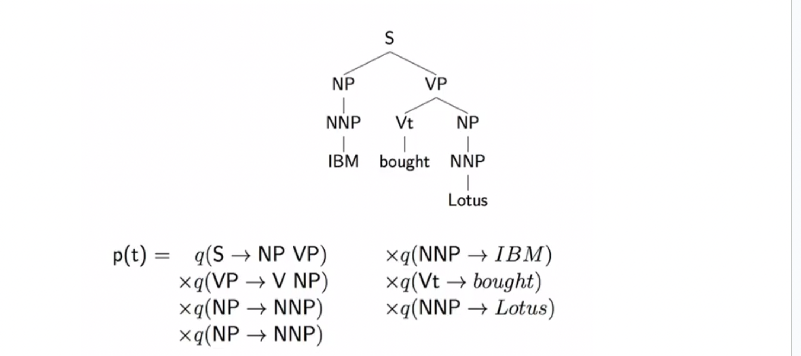
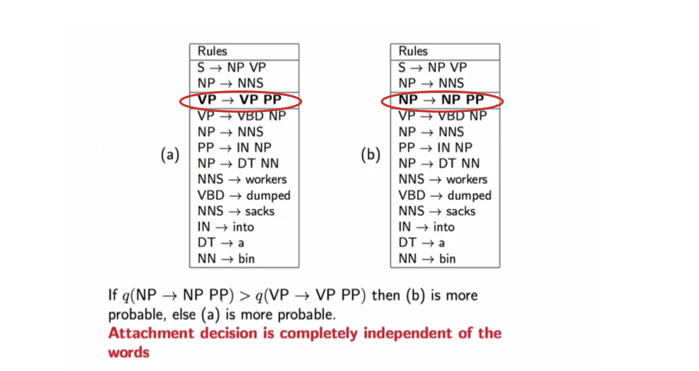
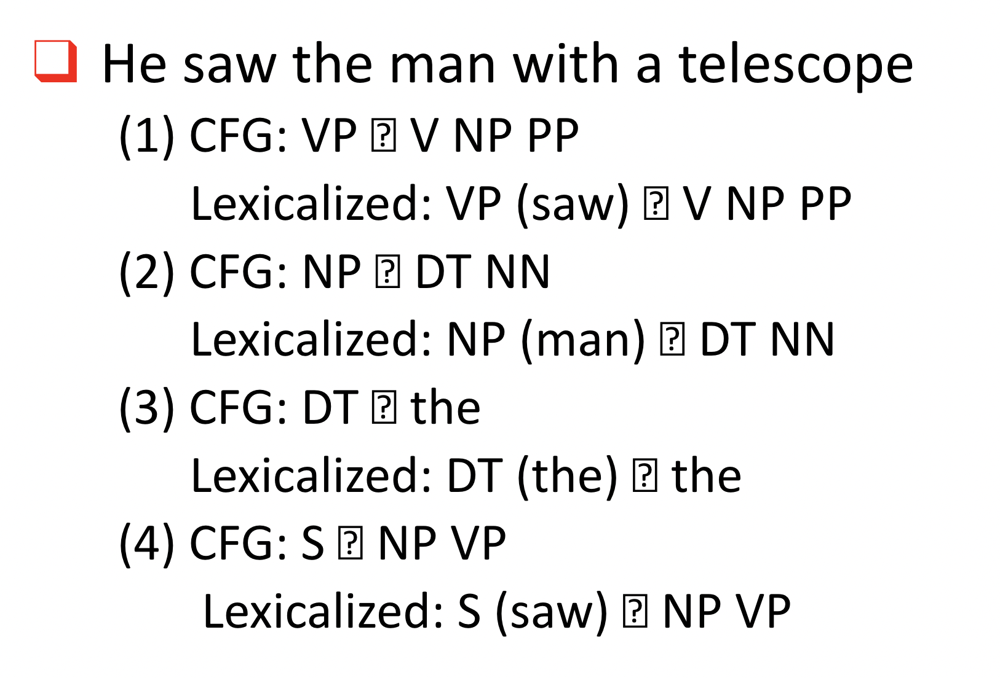
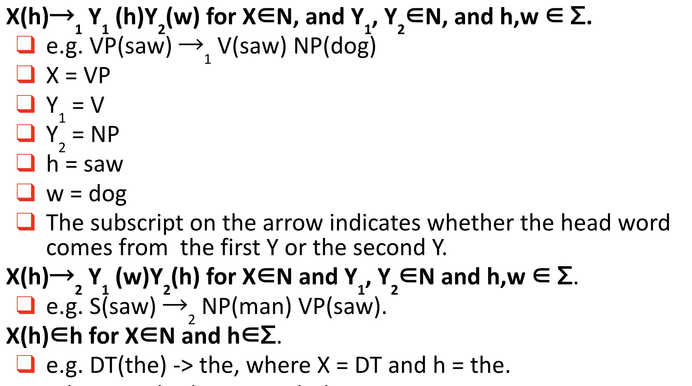
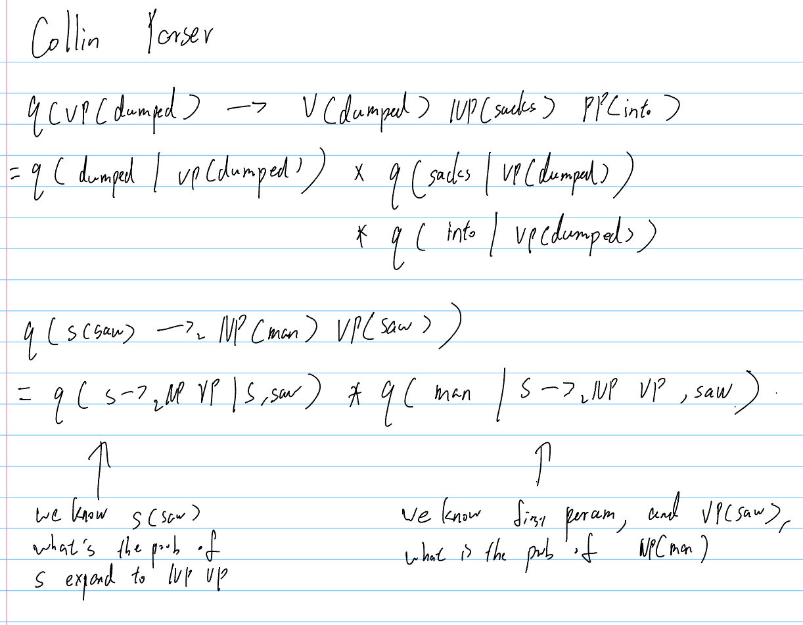

# Lexicalized PCFG

##### Weakness of PCFG

- Lack of sensitivity to to lexical information
- Lack of sensitivity to structural frequency

The assumption of PCFGis that a word in a tree is independent of everything else once it's conditioned on its POS tag



Rules used in the following two trees are identical except one rule, which cause the tree rely totally on single rule



##### PP attachment problem

```
Workers dumped [NP sacks] [PP into a bin]
Fishermen caught [NP tons [PP of herring]]

PCFG will always select the same attachment in both cases because it does not model lexical preferences
```

#### Adding head to rules



**Impact**
* if we had N non-terminals in a CFG
* N * |V| non-terminals in a lexicalized PCFG

#### Lexicalized PCFG in CNF



**Question**: Suppose we have a PCFG with |N|=10 non-terminals and | Σ|=1000. How many possible lexicalized rules can we have?

```
X(h) ->1 Y1(h) Y2(w)
X 10
h 1000
Y1 10
h 1
Y2 10
w 1000
```


#### Assumptions

