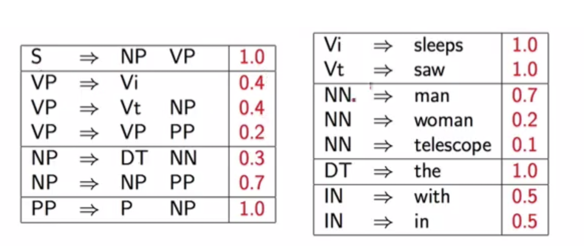
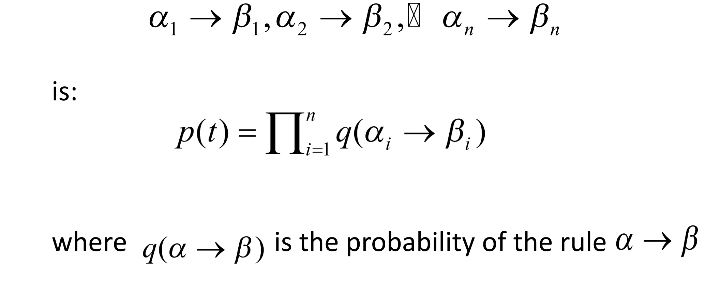
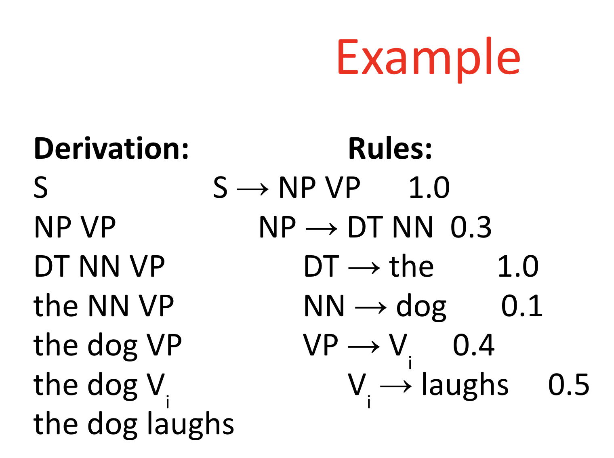
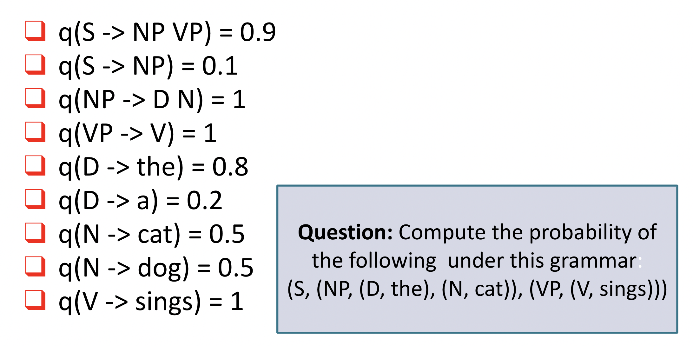

# PCFG

Similar to CFG, PCFG assign a probability to each rule, allowing we can compute the probabilty of the tree and choose the parse tree that has **highest probability**.

#### The sum of all probabilities of rules with identical LHS Non-terminal should sum to *1* 



#### The probability of a tree is the product of all rules used


<br/>


```
    Ans:
    p(t) = 1.0 * 0.3 * 1.0 * 0.1 * 0.4 * 0.5
```

<br/>


```
Rules:
S -> NP VP          p(t) = 0.9 * 1 * 0.8 * 0.5 * 1 * 1
NP -> D N
D -> the
N -> cat
VP -> V
V -> sings
```

#### How do we calculate q(a -> b) ?

q(a -> b) = count(a -> b) / count(a)

count(x) or count (x -> y) are taken from the training data.

Example:

> q(VP -> VT NP) = count(VP -> VT NP) / count(VP)


#### Limitation of PCFG

When we want to find the most likely tree, we have to calculate the probability of all trees. However, the amount of parse trees are can grow **exponentially** in sentence length. Therefore, we can't use brute force. But we can represent all rules in our grammar in Chomsky Normal Form and then solve the parsing problem with **dynamic programming (CKY algorithm)**

- Lack of sensitivity to to lexical information
- Lack of sensitivity to structural frequency


#### Chomsky Normal Form

A CFG G = (N, E, R, S) is in **Chomsky Normal Form** if 

* For rules in **R**, and each of them are in one of following form
  * X -> Y Z, such that X, Y, X are Non-terminal (must be **Two** nonterminal on **RHS**)
  * Y -> a, such that Y is a Nonterminal, **a** is a terminal. (Only one terminal on **RHS**)
* In other words, there should be **no RHS** that includes both nonterminal and terminal.


#### CYK Algorithem - a dynamic programming question

##### Goal: arg max *p(t)*, t is a tree

**Definition**

- n - number of words in the sentence
- wi = word in position i
- N - the set of non-termianl symbols
- S - start symbole

Define a dynamic programming table:

&pi; [*i, j, X*]


